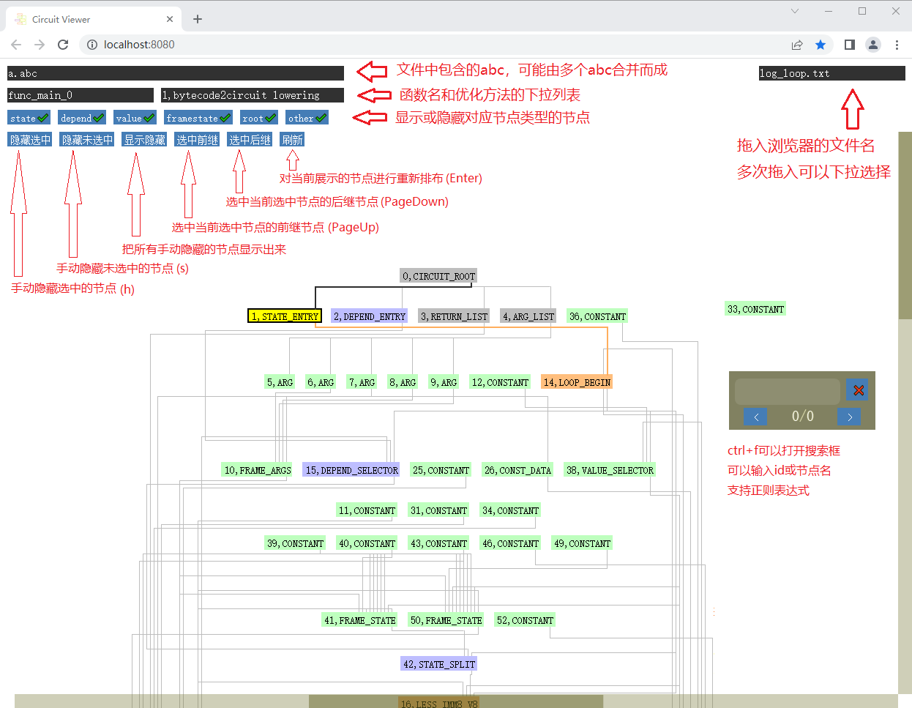

# Circuit IR可视化工具使用说明

## 简介

Circuit IR可视化工具支持将ark_aot_compiler命令行生成的log展示成流图，以便分析。

### 使用说明

生成log需要在ark_aot_compiler命令行后面添加参数：--compiler-log=all012 --log-level=info

根据开发说明打包工具，并运行起来：

[开发说明](./DEVELOP_zh.md)

将log拖入浏览器窗口区域，等待解析完成，界面功能如下图所示：

节点颜色和选中节点后线的颜色可以在dist/config.json中配置

拖动画面有3个方法：

1，鼠标右键按住拖动

2，鼠标滚轮上下滚动

3，右侧和底部的滚动条

## 注意

暂无
