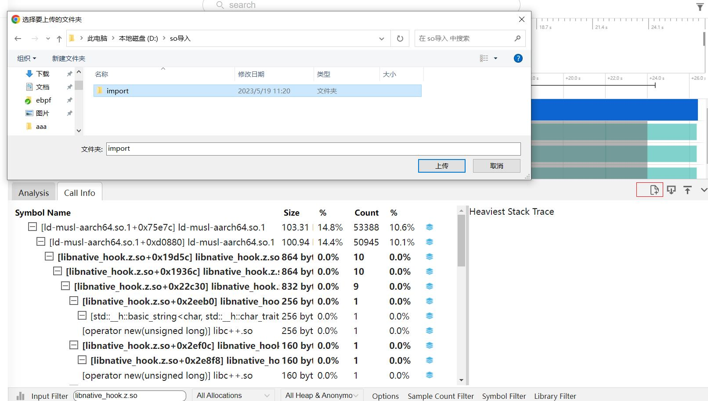
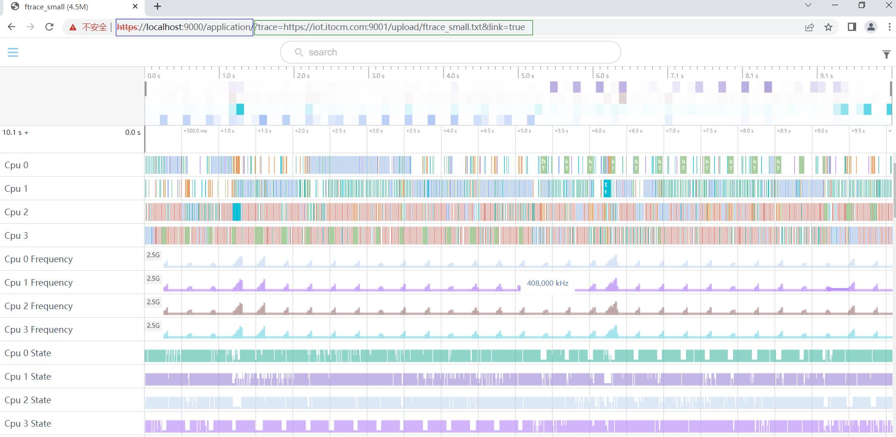

## 应用操作技巧
 应用操作技巧主要展示各个小模块的使用技巧。

###可导入符号表
符号表导入适用于所有支持调用栈的Tab页，选择一个文件夹，获取文件下及其子文件夹的所有so文件，更新数据库中符号数据。文件夹内so的格式需要与在设备上的路径一致，例如下图中，选择的文件夹为import，选择导入的libnative_hook.z.so，在设备上的路径是/system/lib64/，那么在本地选择的文件夹内也需要保证路径是import/system/lib64/libnative_hook.z.so。

以NativeMemory举例，导入NativeMemory文件，点击Call info的Tab页，在搜索框中输入libnative_hook.z.so，会发现该so下的调用栈没有符号化完全。

将本地编译的so通过导入按钮导入，本地导入路径是import/system/lib64/libnative_hook.z.so，红框处是导入按钮

导入so以后，在搜索框中输入libnative_hook.z.so，会发现符号化数据已经更新

###网页连接文件打开接口
网页连接文件打开接口可以在网址后增加文件地址，打开后直接打开trace。
接口的url路径如下：

+     蓝色框：是Smartperf工具的url(https://localhost:9000/application/)。
+     绿色框：trace文件的url，其中
                    第一部分是?trace=(固定格式)。
                    第二部分是trace文件的url(https://iot.itocm.com:9001/upload/ftrace_small.txt),此处根据文件的url实际地址填写。
                    第三部分,&link=true(固定格式)。
