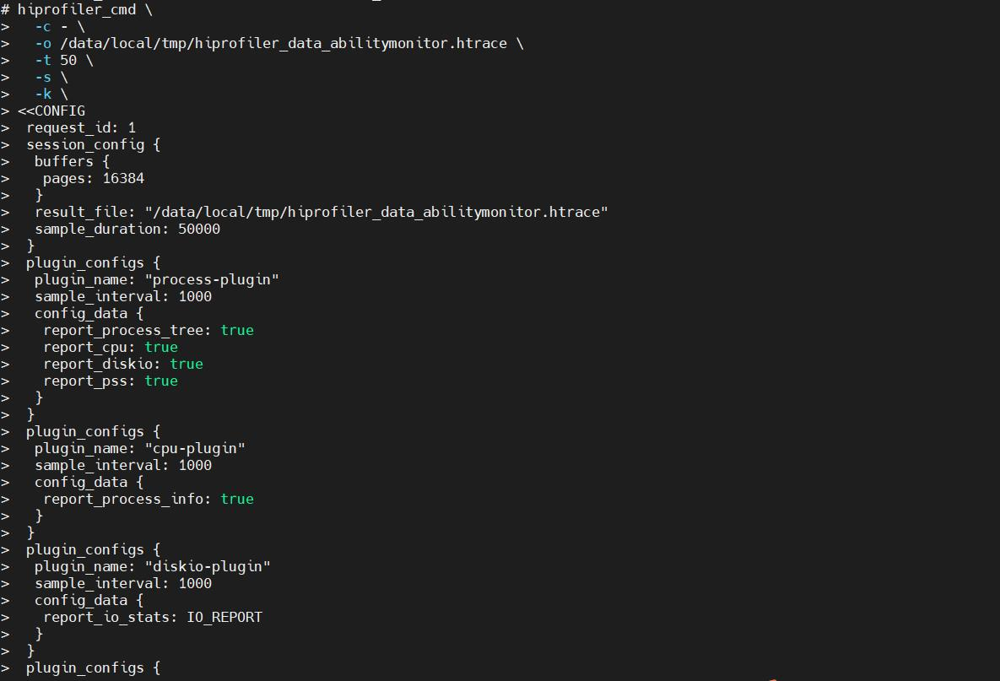
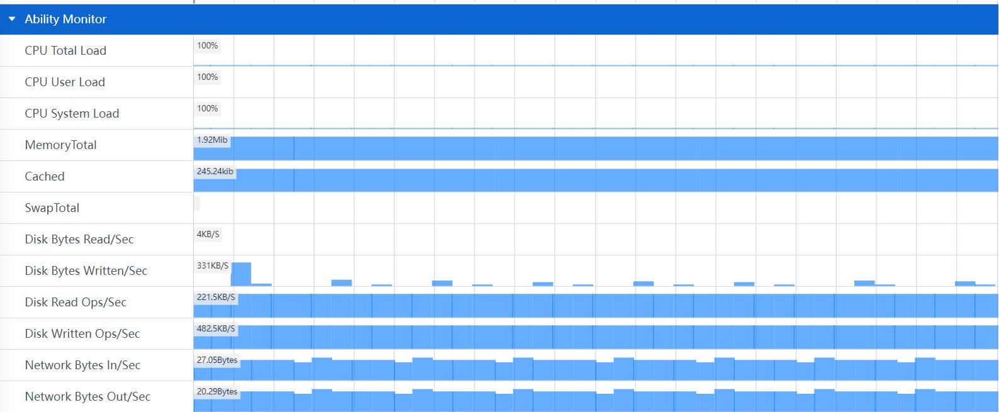
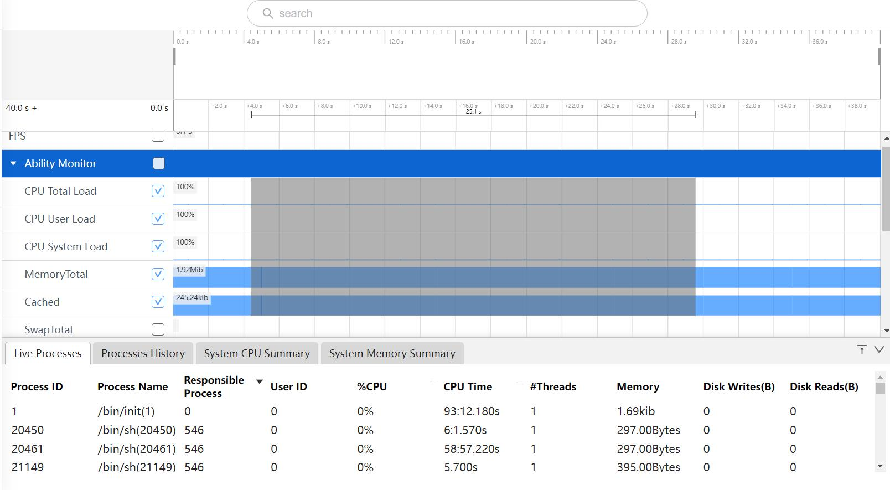
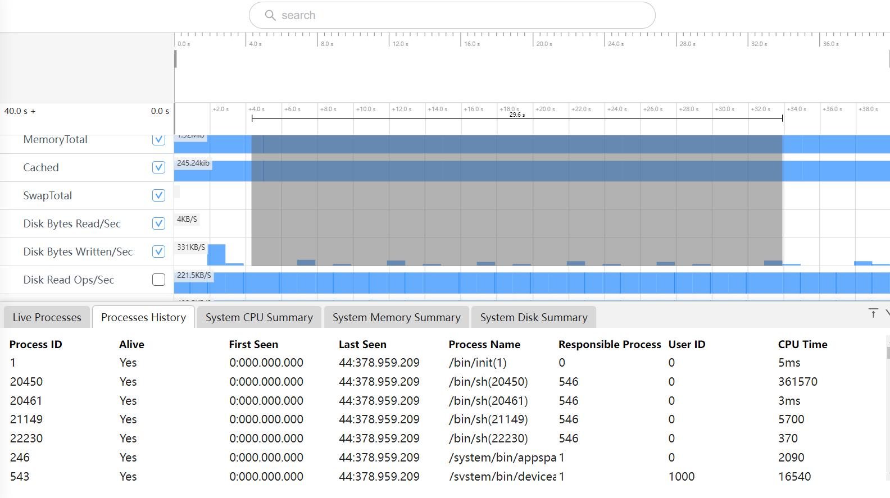
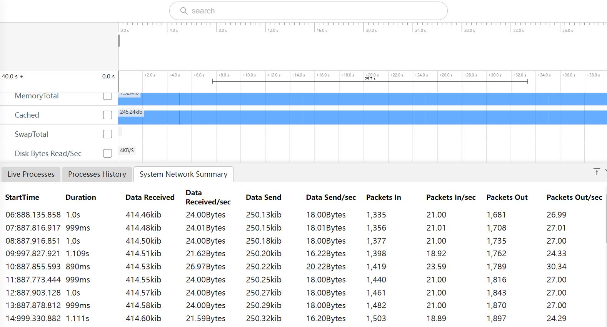

# Ability Monitor抓取和展示说明
抓取和展示处理的CPU，内存，磁盘IO和网络使用情况统计。
## Ability Monitor的抓取
### Ability Monitor抓取界面配置说明
点击Probes config，如选择抓取AbilityMonitor。

### Ability Monitor文件的抓取
点击Record setting，在output file path输入文件名hiprofiler_data_abilitymonitor.htrace，拖动滚动条设置buffer size大小是64M，抓取时长是50s。

点击Trace command，就会根据上面的配置生成抓取命令，点击复制按钮，会将命令行复制。

输入hdc_shell，进入设备，执行命令。

进入指定目录，cd /data/local/tmp进入到目录，会看到生成的trace文件。

## Ability Monitor功能介绍
将抓取的文件导入到smartperf工具查看，能了解CPU，内存，磁盘IO和网络的使用情况。
### Ability Monitor泳道图展示
Ability Monitor展开就可以看到泳道图，包括CPU，内存，磁盘IO，网络的使用情况。

+     CPU Total Load：总的CPU使用率。
+     CPU User Load：CPU在用户态空间运行的使用率。
+     CPU System Load：CPU在内核空间运行的使用率。
+     MemoryTotal： 总计物理内存的大小。
+     Cached：缓存的大小。
+     SwapTotal： 虚拟内存。
+     Disk Bytes Read/Sec：每秒从磁盘读取到内存的字节数。
+     Disk Bytes Written/Sec： 每秒从内存写入磁盘的字节数。
+     Disk Read Ops/Sec：读入的字节数。
+     Disk Written Ops/Sec： 写入的字节数。
+     Network Bytes In/Sec：每秒接收的网络数据字节数。
+     Network Bytes Out/Sec： 每秒发送的网络数据字节数。
+     Network Packets In/Sec：每秒接收的网络数据包数。
+     Network Packets Out/Sec： 每秒发送的网络数据包数。
### Ability Monitor泳道图的框选功能
可以对CPU，内存，磁盘IO和网络的数据进行框选，框选后在最下方的弹出层中会展示框选数据的统计表格，总共有六个tab页。
Live Processes的Tab页如图：

+     Process ID：进程的ID。
+     Process Name：进程名称。
+     Responsible Process：父进程ID。
+     User ID：用户ID。
+     %CPU：进程的CPU占用率。
+     CPU Time：CPU运行时间。
+     #Threads：进程的线程数量。
+     Memory：内存值。
+     Disk Writes(B)：磁盘读入的字节数。
+     Disk Reads(B)：磁盘写入的字节数。
Processes History的Tab页如图：

+     Process ID：进程ID。
+     Alive：进程是否存活。
+     First Seen：开始时间。
+     Last Seen：所选区域的结束时间。
+     Process Name：进程名称。
+     Responsible Process：父进程ID。
+     User ID：用户ID。
+     CPU Time：CPU运行时间。
框选CPU Total Load，CPU User Load，CPU System Load三个区域的泳道图，会展示System CPU Summary的Tab页。

+     Start Time：采集时间的时间戳。
+     Duration：前一次采集到本次采集的时间差。
+     TotalLoad%：总的CPU使用率。
+     UserLoad%：CPU在用户态空间运行的使用率。
+     SystemLoad%：CPU在内核空间运行的使用率。
+     Process：进程号。
框选MemoryTotal，Cached，SwapTota三个区域的泳道图，会展示System Memory Summary的Tab页。

+     Start Time：采集时间的时间戳。
+     Duration：前一次采集到本次采集的时间差。
+     MemTotal：总内存大小。
+     MemFree：空闲内存大小。
+     Buffers：文件的缓冲大小。
+     Cached：缓存的大小。
+     Shmem：已被分配的共享内存大小。
+     Slab：内核数据缓存大小。
+     SUnreclaim：不可回收的Slab大小。
+     Swap Toal：交换空间的总大小。
+     SwapFree：未被使用交换空间的大小。
+     Mapped：设备和文件等映射的大小。
+     VmallocUsed：已被使用的虚拟内存大小。
+     PageTables：管理内存分页的索引表大小。
+     KernelStack：Kernel消耗的内存。
+     Active： 在活跃使用中的缓冲或高速缓冲存储器页面文件的大小。
+     Inactive：在不经常使用中的缓冲或高速缓冲存储器页面文件的大小。
+     Unevictable：不能被释放的内存页。
+     VmallocTotal：可以vmalloc虚拟内存大小。
+     CmaTotal：总的连续可用内存。
+     CmaFree：空闲的可用内存。
框选Disk Bytes Read/Sec，Disk Bytes Written/Sec，Disk Read Ops/Sec，Disk Written Ops/Sec四个区域的泳道图，会展示System Disk Summary的Tab页。

+     Start Time：采集时间的时间戳。
+     Duration：前一次采集到本次采集的时间差。
+     Data Read：从磁盘读取到内存的总字节数。
+     Data Read/sec：每秒从磁盘读取到内存的字节数。
+     Data Write：从磁盘写入磁盘的总字节数。
+     Data Write/sec：每秒从内存写入磁盘的字节数。
+     Reads In：读入的字节数。
+     Reads In/sec：每秒读入的字节数。
+     Write Out：写入的字节数。
+     Write Out/sec：每秒写入的字节数。
框选Network Bytes In/Sec，Network Bytes Out/Sec，Network Packets In/Sec，Network Packets Out/Sec四个区域的泳道图，会展示System Network Summary的Tab页。

+     Start Time：采集时间的时间戳。
+     Duration：前一次采集到本次采集的时间差。
+     Data Received：接收的网络数据总字节数。
+     Data Received/sec：每秒接收的网络数据字节数。
+     Data Send：发送的网络数据总字节数。
+     Data Send/sec：每秒发送的网络数据字节数。
+     Packets In：接收的网络总数据包数。
+     Packets In/sec：每秒接收的网络数据包数。
+     Packets Out：发送的网络总数据包数。
+     Packets Out/sec：每秒发送的网络数据包数。
