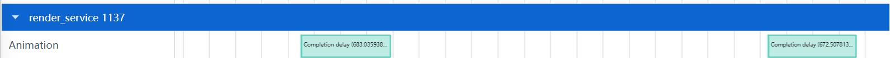
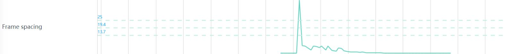
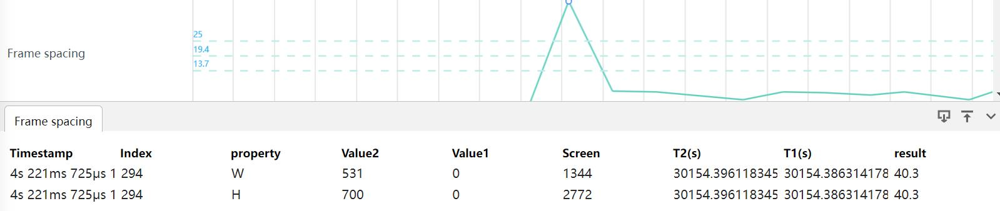
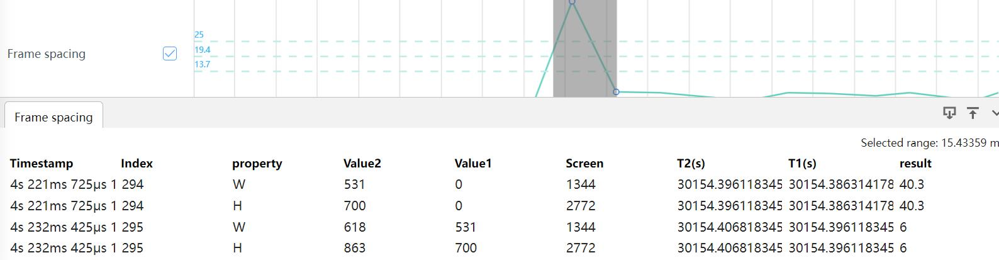

# Animation的抓取和展示说明
通过动效模板的指标项对图形子系统和应用做动效卡顿类问题分析。
### Animation抓取参数的配置

配置项说明：
+     Animation effect：动效配置项的总开关。
### Animation展示说明
将抓取的Animation文件导入到smartperf工具中，查看图形子系统和应用动效卡顿类问题。
### Animation泳道图展示
Animation的响应时延泳道图显示,泳道图的Slice会显示响应时延，如下图中的Completion delay(683.035938ms)。
。
Animation的动效曲线和帧间距的总泳道图，如图点击leashWindow40旁边的小齿轮可以切换leashWindow。
。
Animation的动效曲线泳道图展示，如下：

泳道图说明:
+     Animation Effect Curve旁边的齿轮显示的x,y,width,height,alpha是动效帧的属性值，可以切换。
+     Animation Effect Curve泳道图红色的曲线代表的是异常判断点，也就是相邻两帧属性值相同的异常时间区间。
Animation的帧间距泳道图展示，如下:

泳道图说明:
+     Frame spacing泳道图显示相邻两帧在时间尺度上相对于设备物理屏幕的变化间距值。
### 动效曲线泳道图点选功能
点选动效曲线泳道图上的属性值会出现一个空心小圆点，Frame Dynamic的Tab页会显示相关信息。

+     Timestamp： 时间戳信息。
+     Index： 属性索引。
+     Value：属性值。
### 动效曲线泳道图框选功能
框选动效曲线泳道图，Frame Dynamic的Tab页会显示框选范围内每个点的属性值。

+     Timestamp： 时间戳信息。
+     Index： 属性索引。
+     Value：属性值。
### 帧间距泳道图点选功能
点选帧间距泳道图，Frame spacing的Tab页会显示这一个点的帧间距计算数据，一个点要计算两个属性的的帧间距，所以需要显示两个属性的。

+     Timestamp： 时间戳信息。
+     Index： 属性索引。
+     property：动效宽度或高度属性。
+     Value2： 当前帧的属性值。
+     Value1： 前一帧的属性值。
+     Screen：存储设备的物理宽度/高度。
+     T2(s)： 当前帧的结束时间。
+     T1(s)： 前一帧的结束时间。
+     result：帧间距。
### 帧间距泳道图框选功能
框选帧间距泳道图，Frame spacing的Tab页会显示框选范围内帧间距数据。

+     Timestamp： 时间戳信息。
+     Index： 属性索引。
+     property：动效宽度或高度属性。
+     Value2： 当前帧的属性值。
+     Value1： 前一帧的属性值。
+     Screen：存储设备的物理宽度/高度。
+     T2(s)： 当前帧的结束时间。
+     T1(s)： 前一帧的结束时间。
+     result：帧间距。