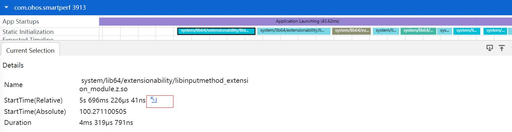
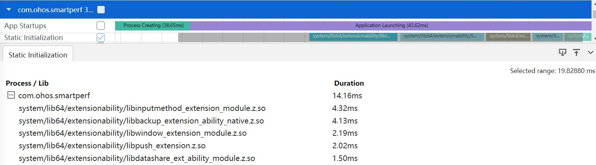

# App startup的抓取和展示说明
应用启动分析功能主要是提供应用启动分析模板帮助系统调优人员做应用启动慢场景问题分析，快速查找系统侧启动慢阶段和耗时长调用栈信息。
### App startup抓取参数的配置

配置项说明：
+     App startup：配置项的总开关。
### App startup展示说明
将抓取的App startup文件导入到smartperf工具中，查看应用启动各阶段耗时的情况。
### App startup泳道图展示
App startup的泳道图展示：

应用启动包括六个阶段，分别是Process Creating(应用进程创建阶段)、Application Launching(加载应用阶段)、UI Ability Launching(加载UI Ability)、UI Ability OnForeground(应用进入前台)、First Frame - APP Phase(首帧渲染提交-应用)、First Frame - Render Phase(首帧渲染提交-Render Service)。每个阶段的Slice上都会显示出该阶段的时延。
### App startup泳道图点选功能
可以对启动各个阶段的Slice进行点选，点选后在最下方的弹出层中会展示点选数据的统计的tab页。
以Process Creating的Slice点选为例：

+     StartTime(Relative)： 应用启动开始时间(相对时间)。
+     StartTime(Absolute)： 应用启动开始时间(绝对时间)。
+     EndTime(Relative)：应用启动的结束时间(相对时间)。
+     EndTime(Absolute)：应用启动的结束时间(绝对时间)。
+     Duration：应用启动的持续时间。
### App startup泳道图Tab页跳转功能
点击各阶段的起始或者结束时间后面的跳转图标，跳转至关联Slice，并显示该Slice的详细信息。
以Process Creating的跳转为例：

跳转说明：
+     StartTime(Relative)的跳转： 跳转到H:virtual int OHOS::AAFwk::AbilityManagerService::StartAbility关键字函数。
+     EndTime(Relative)的跳转： 跳转到H:virtual void OHOS::AppExecFwk::AppMgrServiceInner::AttachApplication关键字函数，并且调用栈要带##应用名，如##com.ohos.smartperf。
### App startup泳道图的框选功能
应用启动阶段泳道图框选功能主要是框选启动分析泳道图之后，统计应用各个启动阶段的耗费时长信息。

+     Process / Startup： 应用名称和启动阶段名称。
+     Duration：应用各阶段启动时长。
+     %：应用各阶段启动时长的占比。
### So初始化泳道图展示
So初始化的泳道图展示：

### So初始化泳道图的点选功能
点选So初始化的Slice，展示该so初始化信息的tab页。

+     Name：So的名称。
+     StartTime(Relative)：So初始化开始时间(相对时间)。
+     StartTime(Absolute)：So初始化开始时间(绝对时间)。
+     Duration：So初始化耗时。
### So初始化泳道图Tab页跳转功能
点击So初始化开始时间后面的跳转图标，跳转至关联Slice，并显示该Slice的详细信息。

跳转说明：
+     StartTime(Relative)的跳转： 跳转到dlopen:  system/lib64/extensionability/libinputmethod_extension_module.z.so。
### So初始化泳道图的框选功能
So初始化泳道图框选功能主要是框选So初始化泳道图之后，统计各个进程下各个So的初始化耗费时长信息。

+     Process / Lib： 应用名称和So名称。
+     Duration：So的耗费时长。