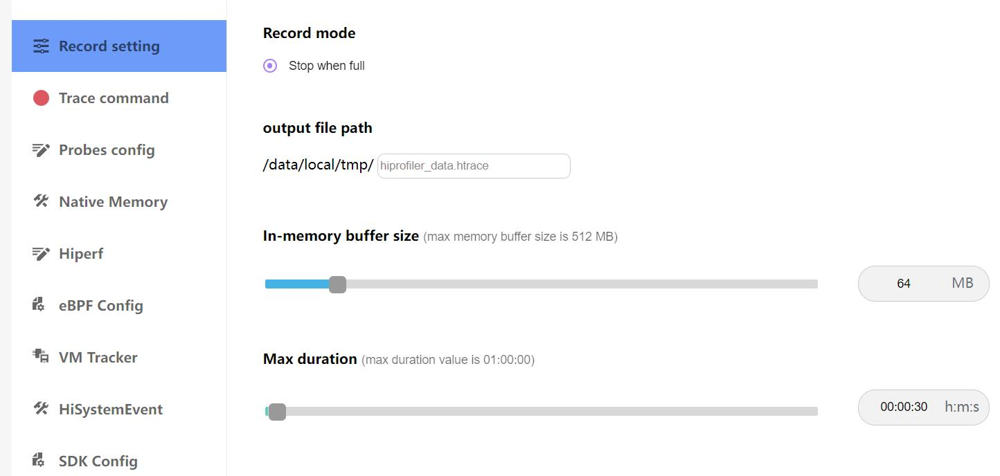
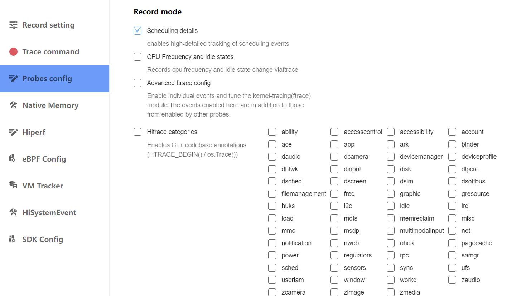
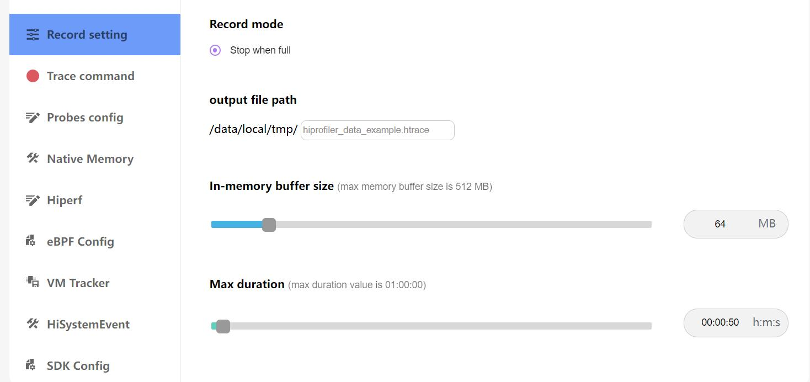
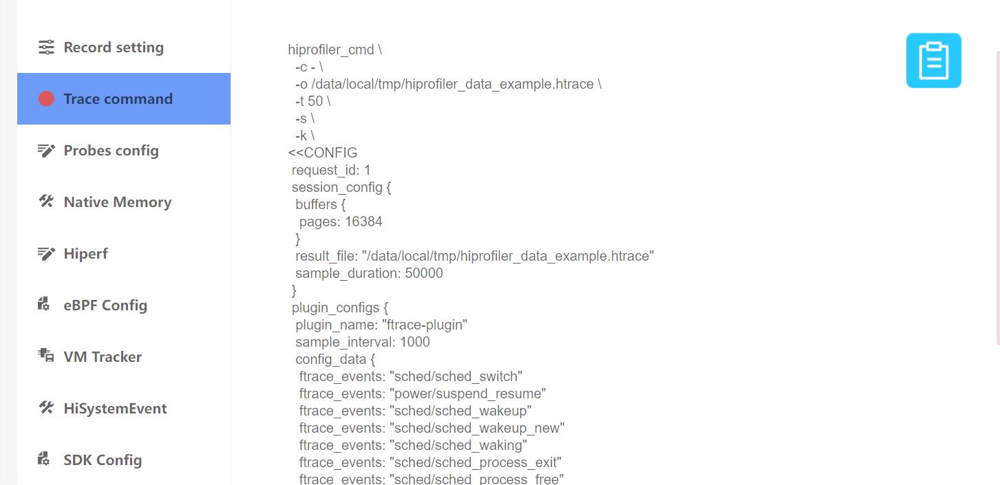
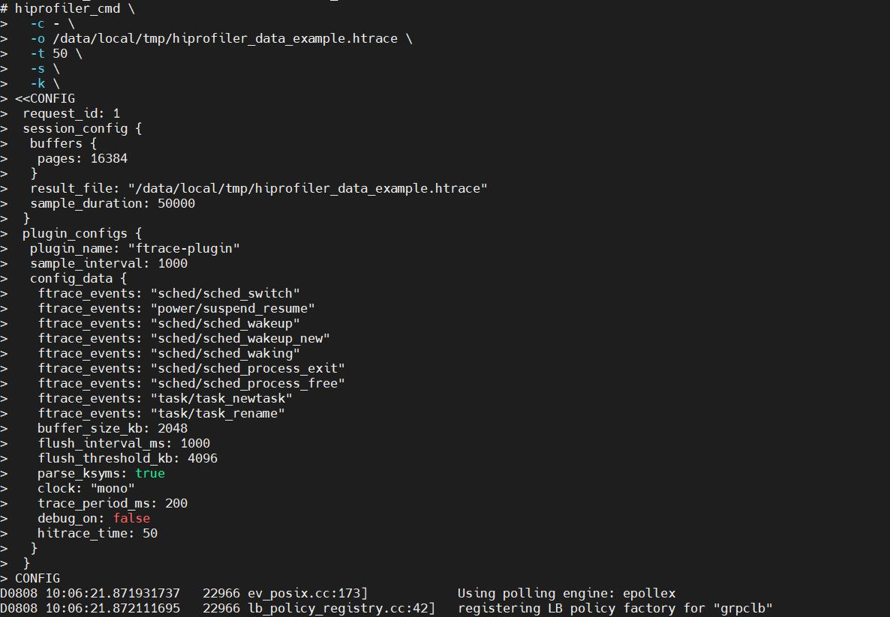

# 设备端抓取trace说明
从设备端抓取trace文件的配置和方法。
## 界面配置说明

说明：
* Record setting:设置trace的抓取模式，buffer size大小，抓取时长。
* Trace command:生成的抓取命令行。
* Probes config:trace的抓取参数配置。
* Native Memory:NativeMemory数据的抓取参数配置。
* Hiperf:Hiperf数据的抓取参数配置。
* eBPF Config:ebpf数据的抓取参数配置。
* VM Tracker:smaps数据的抓取参数配置。
* HiSystemEvent:HiSystemEvent数据抓取参数配置。
* SDK Config:SDK数据抓取参数配置。
## 命令行的生成和trace文件的抓取
点击Probes config，如选择抓取Scheduling details。

再点击Record setting，在output file path输入文件名hiprofiler_data_example.htrace，拖动滚动条设置buffer size大小是64M，抓取时长是50s。

点击Trace command，就会根据上面的配置生成抓取命令，点击复制按钮，会将命令行复制。

命令参数说明：
* -o:文件的输入路径和名称。
* -t:抓取的时长。
* buffer pages:buffer size大小。
* sample_duration:数据采集的时间。
* sample_interval:主动获取插件数据的间隔时间（ms，只针对轮询插件，例如memory插件，cpu插件，dikio插件等，对流式插件和独立插件无效）。
* trace_period_ms:ftrace插件读取内核缓冲区数据的间隔时间（ms）。
* hitrace_time:hitrace命令行抓取时间，与hiprofiler_cmd下发的-t配置联动。

输入hdc_std shell，进入设备，执行命令。

执行完成后，命令行会给出提示。

进入指定目录，cd /data/local/tmp 进入到目录，会看到生成的trace文件。
