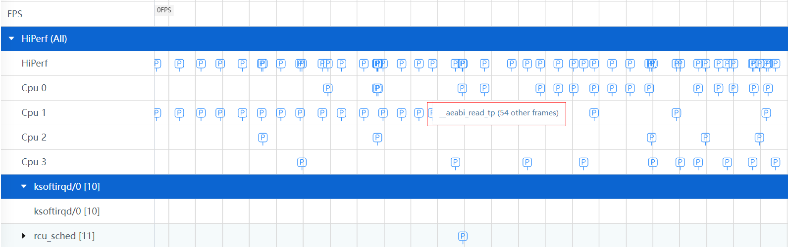
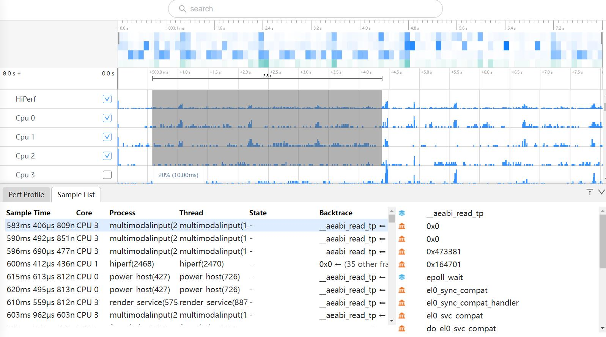
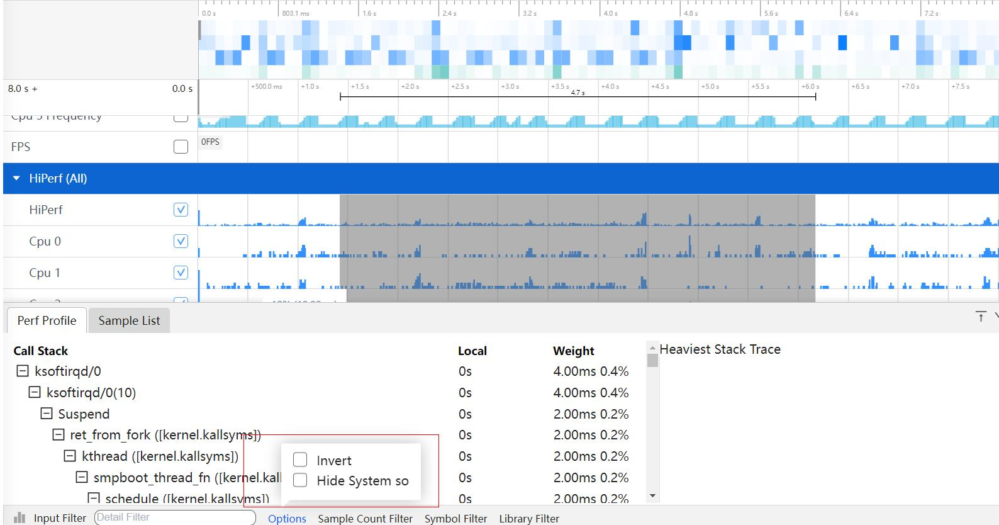
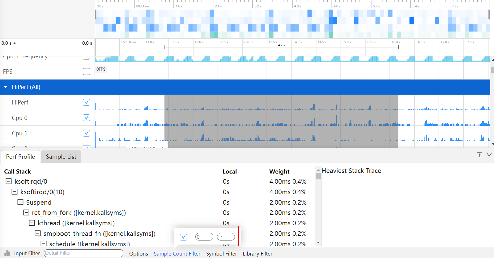
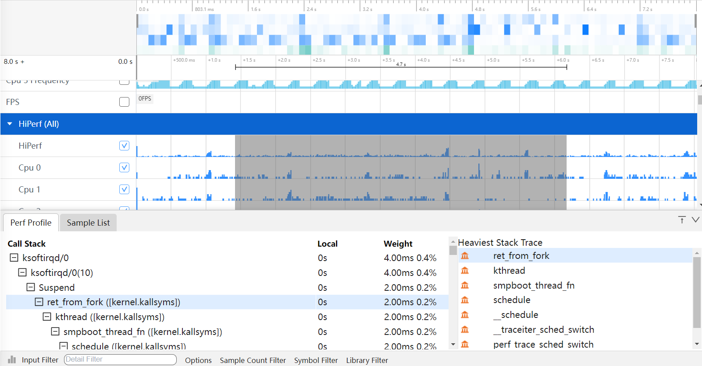
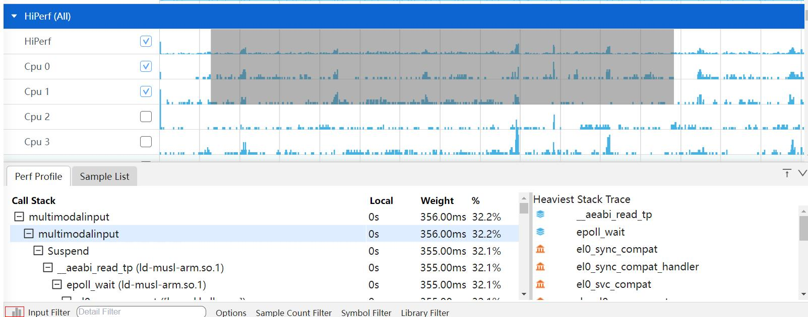
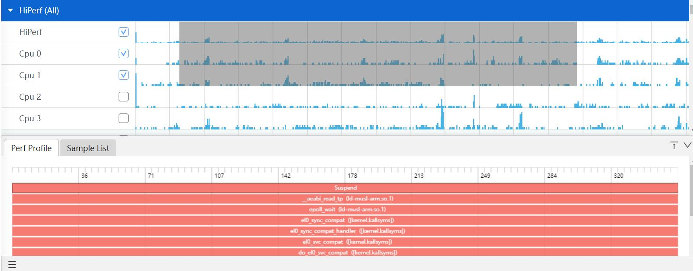

# HiPerf的抓取和展示说明
HiPerf工具是对系统性能数据进行采样记录，并将采样数据保存为文件，进行读取，展示分析。
## HiPerf的抓取
### HiPerf抓取配置参数

配置项说明：
+     Start Hiperf Sampling：配置项的总开关。
+     Process：离线模式下配置的是整个系统的。
+     Frequency：配置抓取的频率。
+     Call Stack：配置抓取的堆栈类型。
+     Advance Options：更多的抓取配置项。
再点击Record setting，在output file path输入文件名hiprofiler_data_perf.htrace，拖动滚动条设置buffer size大小是64M，抓取时长是50s。

点击Trace command，就会根据上面的配置生成抓取命令，点击复制按钮，会将命令行复制。

输入hdc_shell，进入设备，执行命令。

执行完成后，进入指定目录查看，在/data/local/tmp下就会生成trace文件。

### HiPerf展示说明
将抓取的trace文件导入smartperf界面查看。

界面布局介绍：Perf整体界面布局分为3个部分：
+     红色区域：泳道图。
+     绿色区域：详细信息(Perf Profile和Sample List)。
+     黄色区域：辅助信息(Callstack)。

### HiPerf泳道图展示
Perf泳道图展示按照CPU使用量和线程和进程展示，鼠标移动都泳道图上，悬浮框会显示CPU的使用量。

按住w键放大界面，泳道图会出现P的标志，鼠标移动到P图标上，悬浮框会显示每个callstack和调用的深度如下图。

### HiPerf泳道图的框选功能
可以对CPU使用量区，线程和进程区数据进行框选，框选后在最下方的弹出层中会展示框选数据的统计表格，总共有两个tab页。
Perf Profile的Tab页如图：

+     Call Stack：为经过符号解析后的Callstack，并且给出动态链接库或者进程名的信息。
+     Local：为该调用方法自身占用的CPU时间。
+     Weight：调用方法的执行次数和占比。
Sample List的Tab页如图：

+     Sample Time：采样的时间戳信息。
+     Core：当前的CPU核信息。
+     Process：进程名。
+     Thread：线程名。
+     State：运行状态。
+     Backtrace：栈顶的调用栈名称。

### HiPerf支持多种Options展示风格
点击Perf Profile的Tab页底部的Options，会有两个CheckBox复选框。

+     Invert：反向输出调用树。
+     Hide System so：隐藏系统库文件。
### HiPerf支持过滤调用栈调用次数的展示风格
点击Perf Profile的Tab页底部的Sample Counter Filter，可以填上区间值。过滤出符合该区间值调用次数的调用栈信息。

### HiPerf功能的调用栈Group展示-数据分析支持剪裁功能

+  裁剪Callstack，点击Callstack上一个节点符号，再点击底部Symbol Filter按钮，则该符号自动被裁剪掉，同时将该节点往下所有的Callstack内容裁剪掉。

+ 裁剪Library，点击Library Filter按钮，则该库文件符号下所有的子节点也被裁剪。
+ 点击Reset按钮，将恢复选中的裁剪内容。
### HiPerf功能的调用栈Group展示支持按条件过滤
在Input Filter输入关键字，会显示出带有该关键字的展示信息。
 
### HiPerf辅助信息区展示调用栈
当在详细信息区选择一个符号时，将展示与该符号相关的完整的调用栈。对上展示到根节点，对下则展示CPU占用率最大的调用栈。调用栈右侧有Sliding bar可以滚动。
如下图的Heaviest Stack Trace：
 
### HiPerf的火焰图功能
点击Perf Profile左下角的柱状图的图标，会切换到火焰图页面。

进入到火焰图页面，火焰图的展示跟Callinfo的tab页的调用栈显示一致，鼠标放到色块上，悬浮框可以显示调用栈名称和count大小。

鼠标左键火焰图，会进入下一级界面，右键回到上一级。

