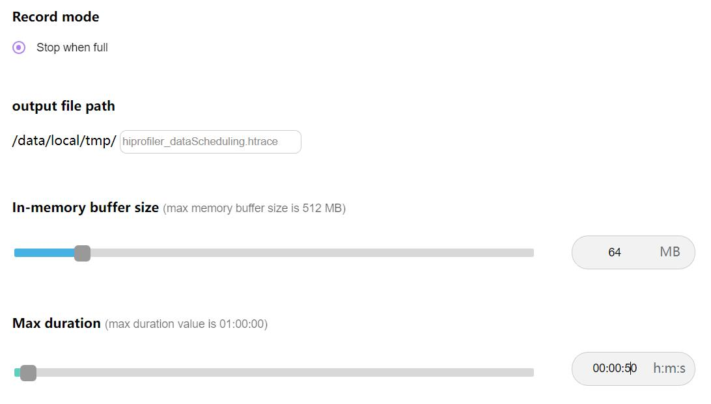
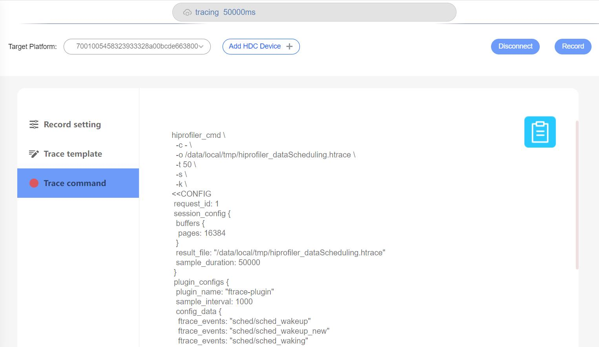
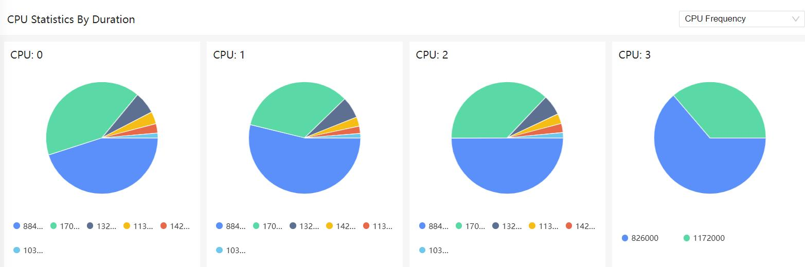
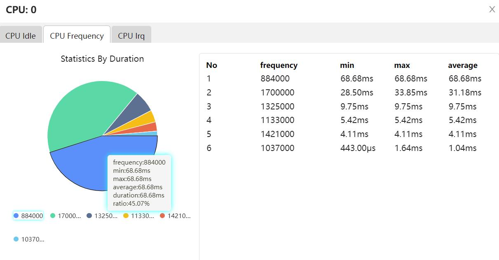
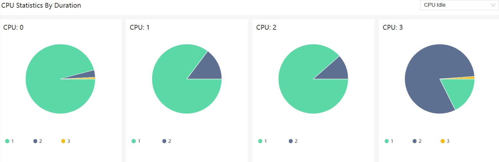
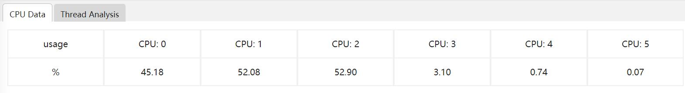
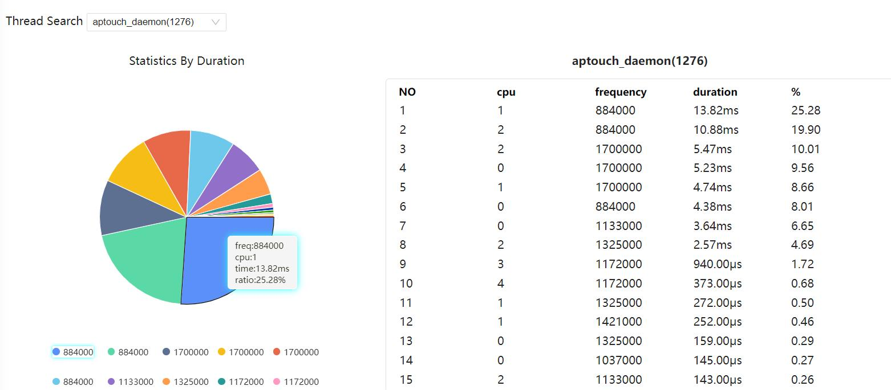
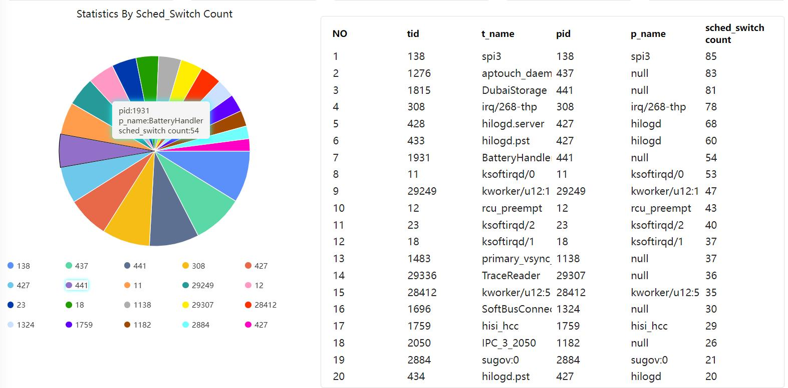

# Scheduling analysis抓取和展示说明
抓取和展示CPU调度分析，线程调度分析相关数据。
## Scheduling analysis的抓取
### Scheduling analysis抓取界面配置说明
打开Scheduling analysis开关抓取调度分析数据。

### Scheduling analysis文件的抓取
点击Record setting，在output file path输入文件名hiprofiler_dataScheduling.htrace，拖动滚动条设置buffer size大小是64M，抓取时长是50s。

点击Trace command，就会根据上面的配置生成抓取命令，点击Record抓取，抓取过程中会显示抓取时长。

## Scheduling analysis功能介绍
将抓取的文件导入到smartperf工具查看。
### CPU频点分析
点击下拉列表框选择CPU Frequency，可以看到各核CPU的各频点持续时长的占比图，以颜色区分各频点。

点击CPU Frequency饼图，可以跳转到详细信息界面，用饼图和表格来展示某个CPU下各频点持续时长的的相关数据。

+     No：编号。
+     frequency：频率。
+     min：最小时长。
+     max：最大时长。
+     average：平均时长。
+     duration：运行总时长。
点击详细页的CPU Frequency饼图，可以跳转某个CPU下某个频点的运行的线程信息。

+     No：编号。
+     t_name：线程名。
+     tid：线程id。
+     p_name：进程名。
+     p_pid：进程id。
+     duration：运行总时长。
### CPU Idle分析
点击下拉列表框选择CPU Idle，可以看到各CPU的Idle的时长占比饼图，以颜色区分各Idle。

点击CPU Idle饼图，可以跳转到某CPU的idle分析的详细数据，以饼图和表格的形式展示。

+     No：编号。
+     idle：idle值。
+     min：最小时长。
+     max：最大时长。
+     average：平均时长。
+     duration：运行总时长。
### CPU Irq分析
点击下拉列表框选择CPU Irq，可以看到各CPU的Irq的时长占比饼图，以颜色区分。

点击CPU Irq饼图，可以跳转到某CPU的Irq分析的详细数据，以饼图和表格的形式展示。

+     No：编号。
+     block：irq的类型。
+     name：irp名称。
+     min：最小时长。
+     max：最大时长。
+     average：平均时长。
+     duration：运行总时长。
### CPU占用率显示
以表格显示各CPU的占用率。

### Top20线程大中小核占用率
选择Thread Analysis标签页，各个CPU通过勾选big或者middle或者small来设置CPU的分类。

各CPU勾选好大中小核，点击Upload可以跳转到各个线程CPU占用率情况的展示页面。

如上图所示：
+     三色柱状图：各个线程CPU的占用率情况，其中以颜色区分占用的大中小核的占用率情况，并以表格的形式展示各个线程的基本信息和大中小核占用率。
+     单色柱状图：分别统计线程在某一个类别（大、中、小）的CPU的占用率，并显示出线程的基本信息和占用率。
表格的字段说明：
+     tid：线程号。
+     t_name：线程名。
+     pid：进程号。
+     p_name：进程名。
+     big core：大核占用时长。
+     middle core：中核占用时长。
+     small core：小核占用时长。
+     cpu..(us)：运行总时长(..代表cpu号)。
### 单个线程频点分布
点击单个线程频点分布的标签，通过在Thread Search选择线程，来展示单个线程的频点分布情况。

+     NO：编号。
+     cpu：cpu编号。
+     frequency：频点。
+     duration：运行时长。
+     %：频点占用率。
### Top20单次运行超长线程
通过点击Top20单次运行超长线程标签，显示线程的单次运行时长来统计出单次运行时长最大的20个线程。

+     NO：编号。
+     tid：线程号。
+     t_name：线程名。
+     pid：进程号。
+     p_name：进程名。
+     max duration：最大运行时长。
+     timestamp：时间戳信息。
### Top20进程线程数
通过点击Top20进程线程数标签，显示线程数量最多的20个进程，以饼图和表格方式显示。

+     NO：编号。
+     pid：进程号。
+     p_name：进程名。
+     thread count：线程数量。
### Top20切换次数线程
通过点击Top20切换次数线程标签，显示切换次数最多的20个进程，以饼图和表格方式显示。

+     NO：编号。
+     tid：线程号。
+     t_name：线程名。
+     pid：进程号。
+     p_name：进程名。
+     sched_switch count：切换次数。

