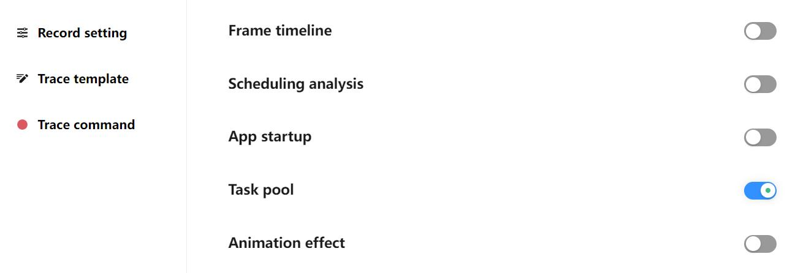
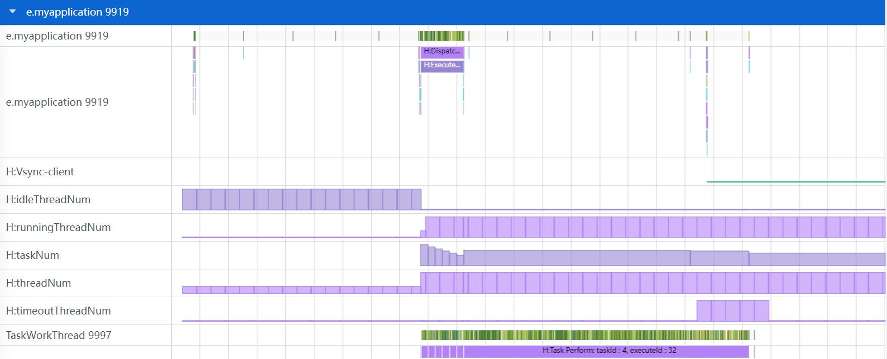
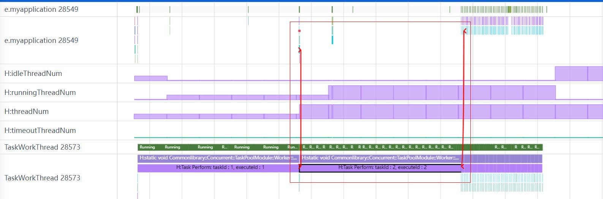
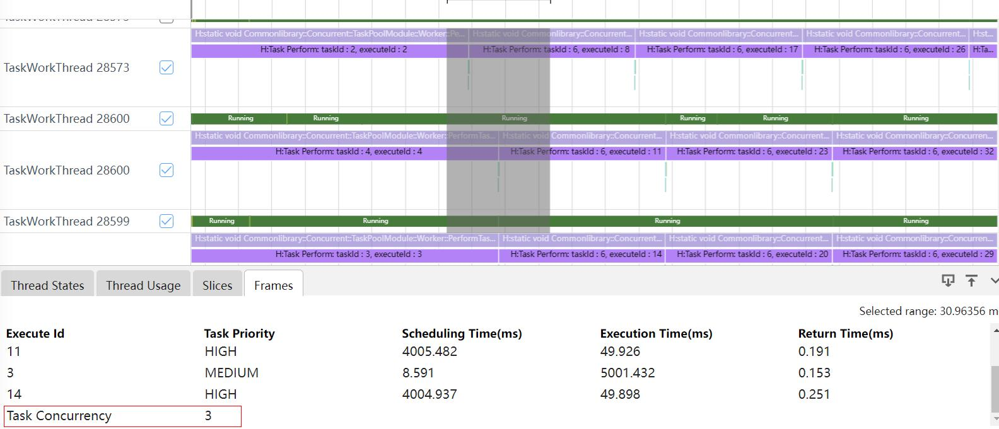
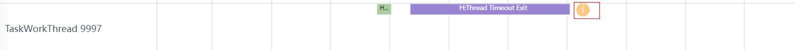

# TaskPool抓取和展示说明
TaskPool分析模块主要展示应用程序使用taskpool时，任务的关联关系，任务调度开销和任务并发度分析情况，任务各阶段耗时情况，线程池的状态统计，队列任务数，任务是否超时。
## TaskPool的抓取
#### TaskPool的抓取配置参数
打开Task pool开关抓取taskpool数据。

### TaskPool展示说明
将抓取的taskpool文件导入到smartperf中，查看任务的关联关系等信息。

### TaskPool的任务关联关系跟踪
任务关联关系就是根据任务的executeId，把一个taskpool任务的各个执行的函数调用栈连接起来，用于表示一个任务从开始分发到执行，再到最后任务结束的整个过程。

如上图所示，点击H:Task Perform: taskId : 2, executeId : 2的调用栈会出现红色连线，红色连线展示了executeId是2的任务的关联关系，连接的调用栈分别是：
+     H:Task Allocation: taskId : 2, executeId : 2, priority : 1, executeState : 1：任务分发。
+     H:Task Perform: taskId : 2, executeId : 2：任务执行。
+     H:Task PerformTask End: taskId : 2, executeId : 2, performResult : Successful：任务返回。
### TaskPool的并发度
点选或者框选任务状态为执行会进行任务并发度展示，如图所示并发度是3。

### TaskPool泳道图的点选功能
点选taskpool的Slice，展示该taskpool信息的tab页。

+     Name： 任务调用栈名称。
+     StartTime： 任务调用栈开始时间。
+     Duration：任务调用栈持续时间。
+     depth：调用栈层级。
### TaskPool泳道图的框选功能
框选taskpool的泳道图，展示Frames的tab页。

+     Execute Id： 任务id。
+     Task Priority： 任务优先级(HIGH，MEDIUM，LOW)。
+     Scheduling Time(ms)：调度耗时(任务执行起始时间 - 任务分发起始时间)。
+     Execution Time(ms)：执行耗时(任务执行的duration)。
+     Return Time(ms)：返回耗时(任务返回的结束时间 – 任务执行的结束时间)。
### TaskPool的队列任务数和线程池里线程状态统计

如上图，H:threadNum，H:runningThreadNum，H:idleThreadNum，H:timeoutThreadNum是线程池里线程状态统计，H:taskNum是队列任务数。
### TaskPool的任务超时退出
在带有H:Thread Timeout Exit的调用栈的泳道图会采用黄色圆圈，中间为白色反叹号标记，代表任务超时退出。
