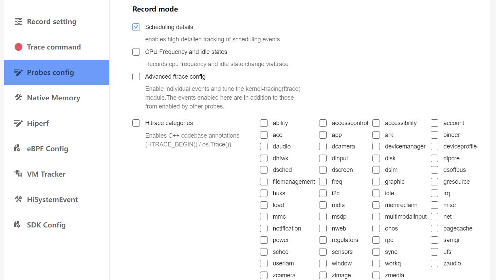
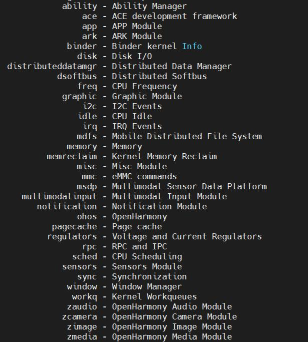
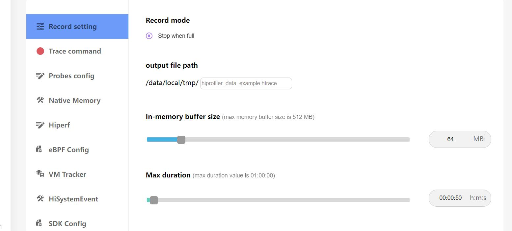

# web端抓取trace说明
从web端抓取trace文件的配置和方法。
## 界面配置说明

说明：
* Record:trace抓取按钮。
* Add HDC Device:连接设备。
## trace文件的在线抓取
点击Add HDC Device在弹出的框里选择HDC-配对，点击连接，连接设备。

点击Probes config，如选择抓取Scheduling details。

抓取项说明：
   * Scheduling details:线程切换事件，暂停恢复方法，线程唤醒事件，进程退出和销毁处理，新建线程处理方法，线程重命名处理方法。
   * CPU Frequency and idle states:CPU频率信息和CPU空闲状态。
   * Advanced ftrace config:线程切换事件，暂停恢复方法，线程唤醒事件，进程退出和销毁处理，新建线程处理方法，线程重命名处理方法，IRQ事件，时钟频率处理方法，Binder事件，线程调用堆栈开始和结束的处理。
   * AbilityMonitor:进程的CPU，内存，磁盘，网络使用情况。
   * Kernel meminfo:内核内存。
   * Virtual memory stats:系统虚拟内存。
   * Hitrace categories:Bytrace的抓取项，各解释项说明如下图：

再点击Record setting，在output file path输入文件名hiprofiler_data_example.htrace，拖动滚动条设置buffer size大小是64M，抓取时长是50s。

点击Trace command，就会根据上面的配置生成抓取命令，点击Record。

抓取过程中，上方会给出提示正在抓取，并显示出抓取时长。

抓取完成后，界面会自动加载展示trace文件。
