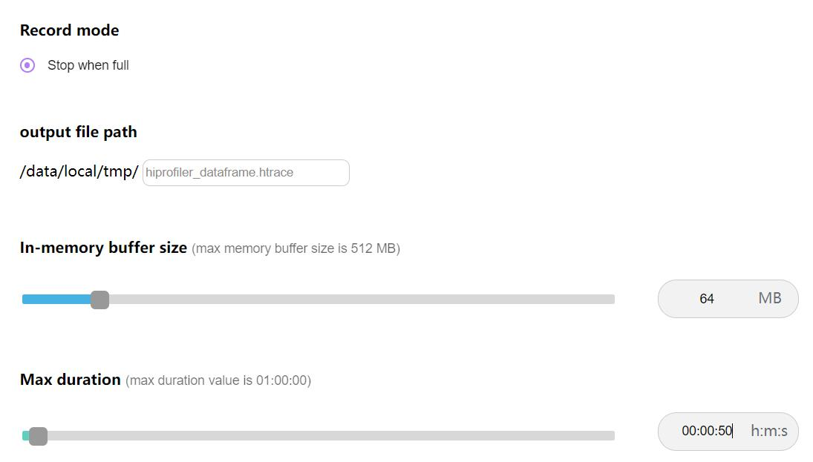
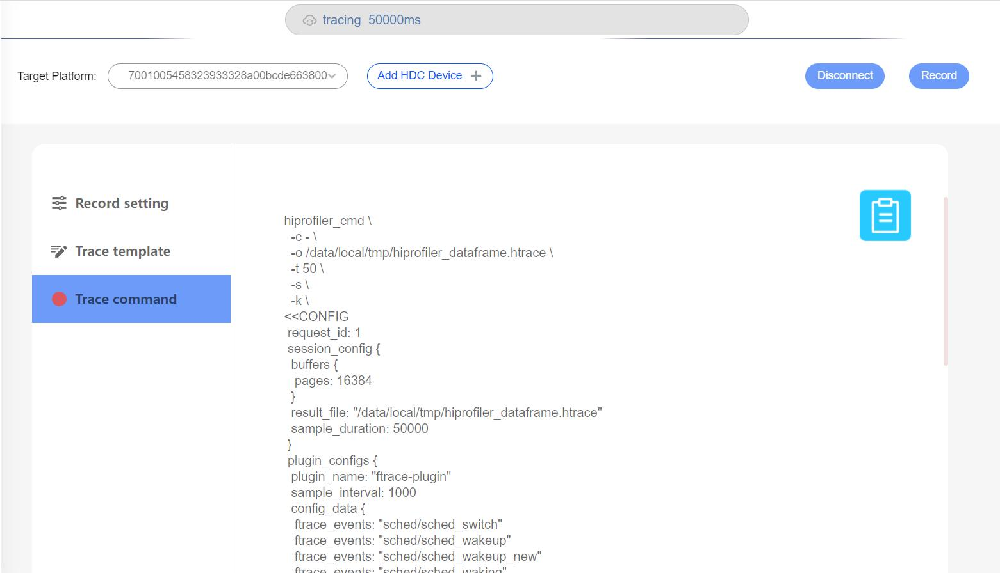
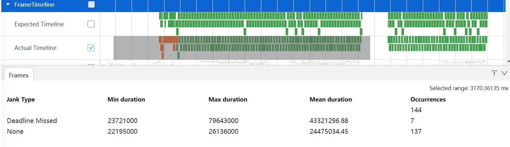
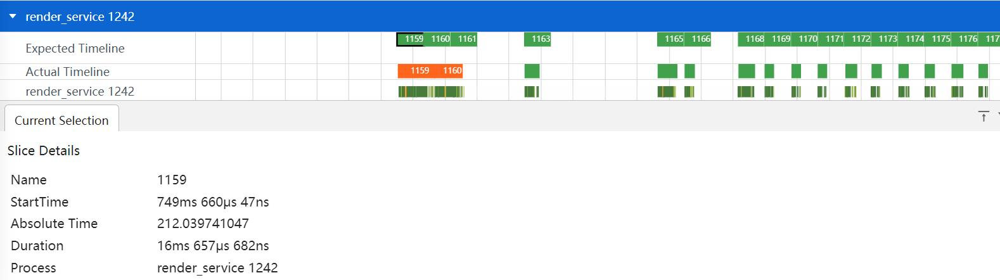
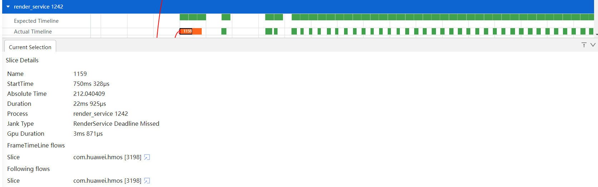

# Frame timeline抓取和展示说明
抓取和展示卡顿丢帧检测的数据。
## Frame timeline的抓取
### Frame timeline抓取界面配置说明
打开Frame timeline开关抓取Frametimeline数据。

### Frame timeline文件的抓取
点击Record setting，在output file path输入文件名hiprofiler_dataframe.htrace，拖动滚动条设置buffer size大小是64M，抓取时长是50s。

点击Trace command，就会根据上面的配置生成抓取命令，点击Record抓取，抓取过程中会显示抓取时长。

## Frame timeline功能介绍
将抓取的文件导入到smartperf工具查看。
### Frame timeline泳道图展示
Frame timeline展开就可以看到泳道图，泳道图上可以显示帧编号。

+     Expected Timeline：理想帧泳道图。
+     Actual Timeline：真实帧泳道图。
### Frame timeline泳道图的框选功能
可以对真实帧数据进行框选，框选后在最下方的弹出层中会展示框选数据的统计表格。
Frames的Tab页如图：

+     Jank Type：卡顿类型。
+     Min duration：最小持续时间。
+     Max duration：最大持续时间。
+     Mean duration：平均持续时间。
+     Occurrences：事件数。
### Frame timeline泳道图的点选功能
通过点选理想帧和真实帧展示Tab页(Current Selection)。
理想帧Tab页如下图：

+     Name：帧编号。
+     StartTime：启动时间。
+     Absolute Time：绝对时间。
+     Duration：持续时间。
+     Process：进程名。
真实帧Tab页如下图：

+     Name：帧编号。
+     StartTime：启动时间。
+     Absolute Time：绝对时间。
+     Duration：持续时间。
+     Process：进程名。
+     Jank Type：卡顿类型。
+     Gpu Duration：GPU耗时。
+     FrameTimeLine flows：显示的是绘制一帧的完整过程,  由两个阶段组成应用的提交一帧。
+     Following flows：展示真实帧包含的关联的帧，图中斜向上箭头点击会进行跳转功能直接定位到具体进程真实帧位置，点选的同时还将包含的关联帧通过线连起来，可以跨越多个进程。
