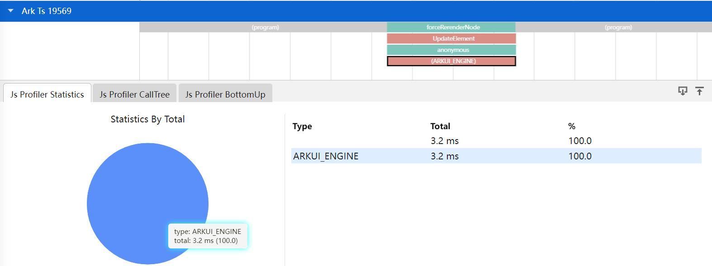
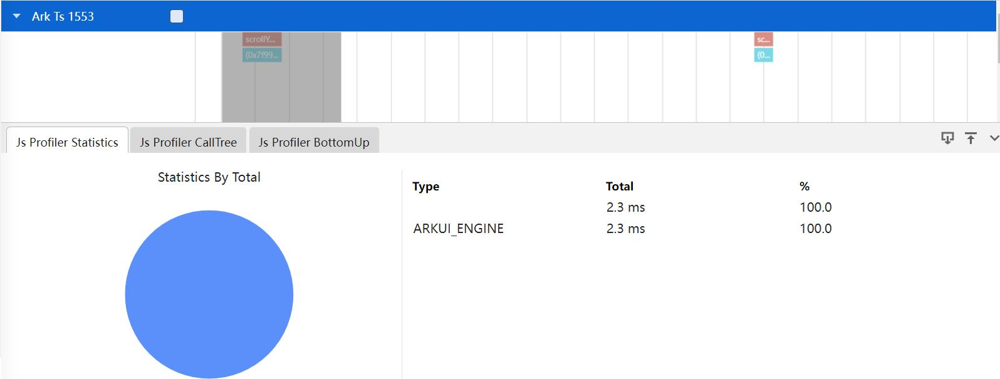
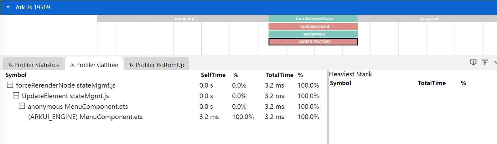
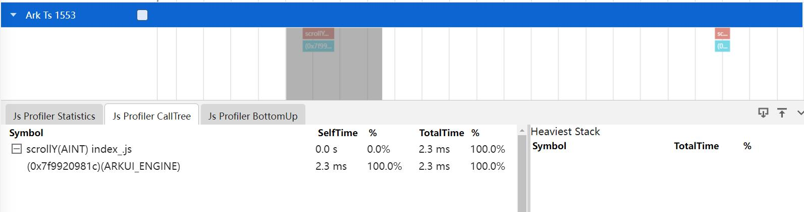
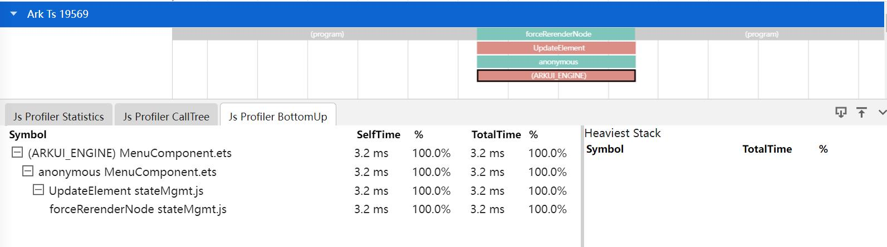

# Cpuprofiler抓取和展示说明
Cpuprofiler模板帮助ArkTs开发和测试分析虚拟机层执行开销大问题，提供Ts层耗时长函数和阶段。
## Cpuprofiler的抓取
#### Cpuprofiler的抓取配置参数
打开Start Ark Ts Record总开关下面的Start cpu profiler开关抓取cpuprofiler数据。

### Cpuprofiler展示说明
将抓取的cpuprofiler文件导入到smartperf中，查看Ts层耗时长的函数和阶段。

### Cpuprofiler的泳道图悬浮显示
鼠标放到泳道图的Slice上会有悬浮框显示。

+     Name : 函数名。
+     Self Time: 函数自身执行时间(不包含其调用者)。
+     Total Time : 函数自身及调用者的调用时间总和。
+     Url : 函数所在的文件名称。
### Cpuprofiler泳道图的点选和框选功能
点选或者框选泳道图上函数名的Slice，会显示Js Profiler Statistics，Js Profiler CallTree，Js Profiler BottomUp的Tab页信息。
Js Profiler Statistics的Tab页显示数据的维度信息，以饼图和Table表的方式展示，如下图：

+     Type : 维度名称，有九大维度(NAPI、ARKUI_ENGINE、BUTLTIN、GC、AINT、CINT、AOT、RUNTIME、OTHER）。
+     Total : 时间。
+     % : 时间占比。
Js Profiler CallTree的Tab页把name，url，depth，parent相同的函数合并，构建成一个top down的树结构，以树形表格的形式显示，表格中显示函数调用关系，如下图：

+     Symbol : 函数名。
+     Self Time: 函数自身执行时间(不包含其调用者)。
+     Total Time : 函数自身及调用者的调用时间总和。
Js Profiler BottomUp的Tab页把name，url，depth，parent相同的函数合并，构建成一个bottom up的树结构，以树形表格的形式显示，只不过作为根节点的是被调用者，表格中显示函数被调用关系，如下图：

+     Symbol : 函数名。
+     Self Time: 函数自身执行时间(不包含其调用者)。
+     Total Time : 函数自身及调用者的调用时间总和。
### Cpuprofiler的Heaviest Stack功能
Js Profiler CallTree的Tab页的Heaviest Stack表格显示的是选中的函数的完整的调用栈。

Js Profiler BottomUp的Tab页的Heaviest Stack表格显示的是选中的函数的完整的逆序调用栈。

+     Symbol : 函数名。
+     Total Time : 函数自身及调用者的调用时间总和。
+     % : 总时间占比。