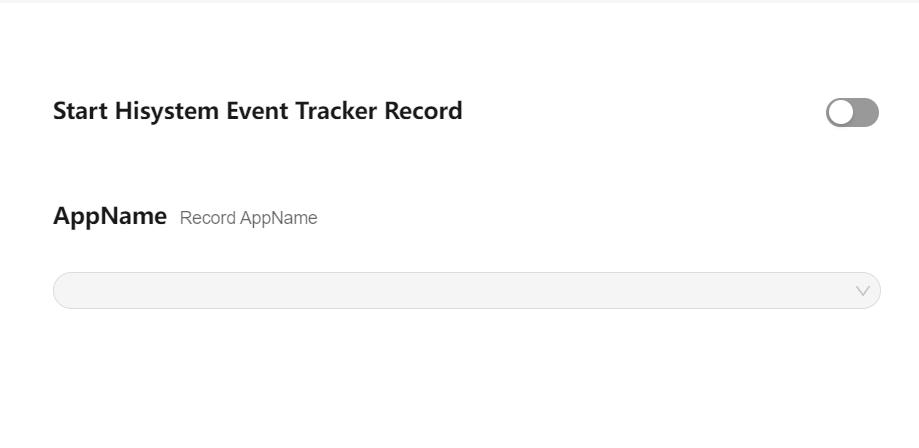
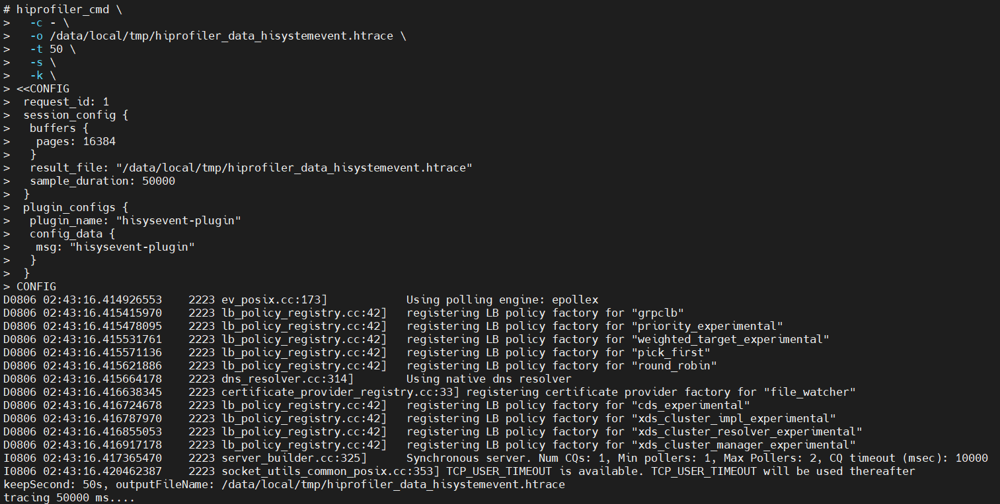
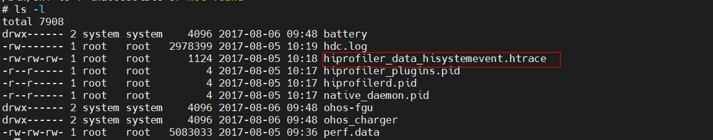
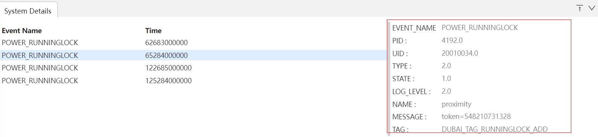
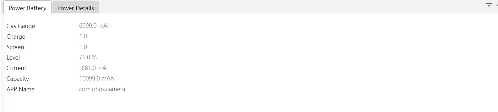

# HiSystemEvent的抓取和展示说明
 HiSystemEvent应用功耗模块主要是展示应用的各个子类别功耗占比信息、应用的资源申请使用记录信息、应用功耗异常事件信息、功耗关联系统状态信息。
## HiSystemEvent的抓取
### HiSystemEvent抓取配置参数
打开Start Hisystem Event Tracker Record开关抓取HiSystemEvent数据。

再点击Record setting，在output file path输入文件名hiprofiler_data_hisystemevent.htrace，拖动滚动条设置buffer size大小是64M，抓取时长是50s。

点击Trace command，就会根据上面的配置生成抓取命令，点击复制按钮，会将命令行复制。

输入hdc_std shell，进入设备，执行上述生成的命令。

执行完成后，进入指定目录查看，在/data/local/tmp下就会生成trace文件。

### HiSystemEvent展示说明
### HiSystemEvent泳道图展示
将抓取的trace文件导入smartperf界面查看。

泳道图说明：
+     Anomaly Event泳道： 显示系统异常和应用异常的ToolTip。
+     System Event泳道： 以条状图显示，红色代表后台任务(WORKSCHEDULER)，黄色代表应用锁(POWER)，蓝色代表GPS定位(LOCATION)。
+     Power泳道：应用各个子类的功耗柱状图、折现图以及应用各个子类绘制的图例，鼠标的悬浮可以显示出各个子类功耗的具体值。
+     Brightness Nit泳道：鼠标悬浮可以显示屏幕亮度值。
+     Wifi Event Received泳道：鼠标悬浮可以显示WiFi信号强度值。
+     Audio Stream Change泳道：鼠标悬浮可以显示Audio状态(AUDIO_STREAM_CHANGE事件)。
+     Audio Volume Change泳道：鼠标悬浮可以显示Audio状态(AUDIO_VOLUME_CHANGE事件)。
+     Wifi State泳道：鼠标悬浮可以显示wifi开关状态(enable：开，disable：关)。
+     Bluetooth Br Switch State泳道：鼠标悬浮可以显示蓝牙开关状态(enable：开， disable：关)。
+     Location Switch State泳道：鼠标悬浮可以显示GPS开关状态(enable：开，disable：关)。
### HiSystemEvent泳道图的框选功能
可以对Energy各泳道图进行框选，框选后在最下方的弹出层中会展示框选数据的统计表格。
System Details的Tab页如图：

+     Event Name： 事件名称，事件包括后台任务，应用锁，GPS定位。
+     Time： 时间戳信息。
点击事件名会显示该事件的详细信息的Tab页。

+     EVENT_NAME：事件名称。
+     PID：应用PID。
+     UID：应用UID。
+     TYPE：类型。
+     STATE：状态值。
+     LOG_LEVEL：日志级别。
+     NAME：NAME信息。
+     MESSAGE：MESSAGE信息。
+     TAG：锁名。
Power Battery的Tab页如图：

+     Gas Gauge： 电池电量。
+     Charge：充电状态。
+     Screen：屏幕状态。
+     Level：电池百分比。
+     Current：电池电流。
+     Capacity：电池容量。
+     APP Name：应用包名。
Power Details的Tab页如图：

+     UID： 应用UID。
+     Charge：充电状态。
+     Foreground Duration(ms)：前台使用时长。
+     Foreground Energy(mAs)：前台使用功耗值。
+     Background Duration(ms)：后台使用时长。
+     Background Energy(mAs)：后台使用功耗值。
+     Screen On Duration(ms)：亮屏使用时长。
+     Screen On Energy(mAs)：亮屏使用功耗值。
+     Screen Off Duration(ms)：灭屏使用时长。
+     Screen Off Energy(mAs)：灭屏使用功耗值。
+     Foreground Count：应用前台扫描次数。
+     Background Count：应用后台扫描次数。
+     Screen On Count：应用亮屏扫描次数。
+     Screen Off Count：应用灭屏扫描次数。
+     Background Time(ms)：灭屏使用功耗值。
+     Screen On Time(ms)：应用亮屏使用时长。
+     Screen Off Time(ms)：应用灭屏使用时长。
+     Energy(mAs)：功耗值。
+     Load(%)：占用率。
+     Usage(ms)：应用使用时长。
+     Duration(ms)：持续时长。
+     Camera Id：Camera类型，0：后置，1：前置。
+     Count：应用个数。
+     Energy Percent(%)：功耗占比。