# 系统内存抓取和展示说明
系统内存分析模板帮助系统内存调优人员进行进程内存拆解。
## 系统内存的抓取
#### 系统内存的抓取配置参数
打开VM Tracker开关抓取内存数据。

### 系统内存展示说明
将抓取的内存文件导入到smartperf中，查看进程内存的情况。

### 系统内存中Ability Monitor泳道图显示
Ability Monitor泳道图分为MemoryTotal，Cached，SwapTotal，System Purgeable Total，System Purgeable Pin，DMA，Skia Gpu Memory泳道。
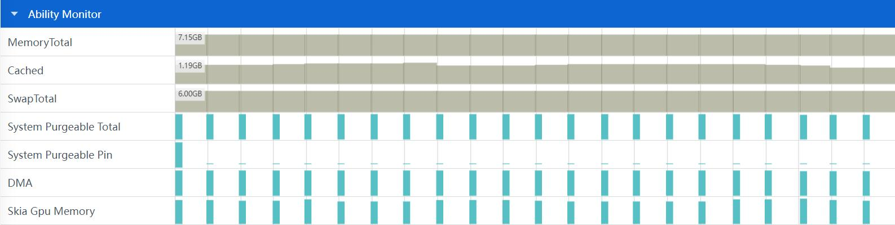
### 系统内存中Ability Monitor泳道图点选功能
System Purgeable Total泳道图点选功能。

+     TimeStamp：时间戳。
+     ActivePurg：当前时间点的ActivePurg内存。
+     InActivePurg：当前时间点的InActivePurg内存。
+     ShmPurg：当前时间点的ShmPurg内存。
System Purgeable Total泳道图框选功能。
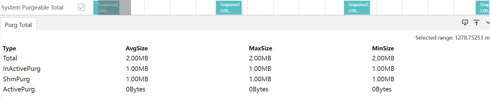
+     Type：内存的类别。
+     AvgSize：当前内存的平均值。
+     MaxSize：当前内存的最大值。
+     MinSize：当前内存的最小值。
System Purgeable Pin泳道图点选功能。
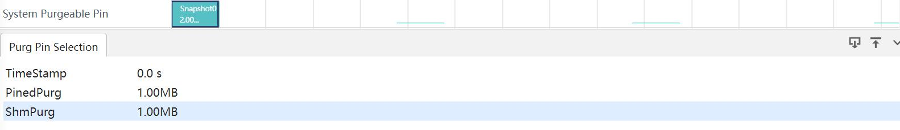
+     TimeStamp：时间戳。
+     PinedPurg：当前时间点的PinedPurg内存。
+     ShmPurg：当前时间点的ShmPurg内存。
System Purgeable Pin泳道图框选功能。

+     Type：内存的类别。
+     AvgSize：当前内存的平均值。
+     MaxSize：当前内存的最大值。
+     MinSize：当前内存的最小值。
DMA泳道图点选功能。
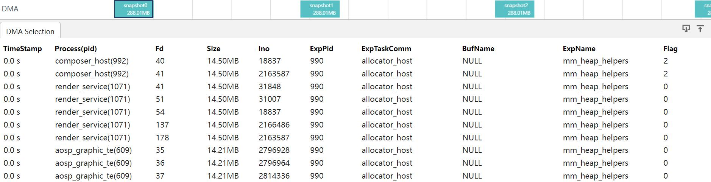
+     TimeStamp：时间戳。
+     Process(pid)：进程名(进程ID)。
+     Fd：DMA内存文件描述符。
+     Size：DMA内存大小。
+     Ino：Ino值。
+     ExpPid：申请者的进程号。
+     ExpTaskComm：ExpTaskComm的值。
+     BufName：DMA内存名。
+     ExpName：申请者的进程名。
+     Flag：去重标记，0表示正常，1表示进程内部重复数据，2表示进程间重复数据。
DMA泳道图框选功能。
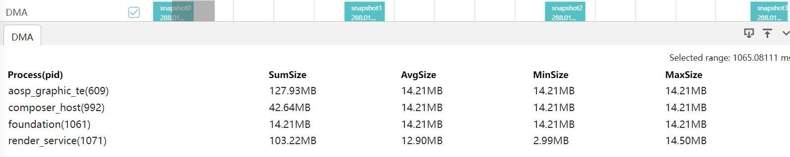
+     Process(pid)：进程名(进程ID)。
+     SumSize：DMA内存总量。
+     AvgSize：DMA内存的平均值。
+     MaxSize：DMA内存的最大值。
+     MinSize：DMA内存的最小值。
Skia Gpu Memory泳道图点选功能。
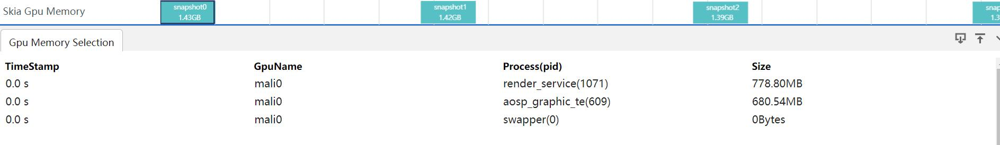
+     TimeStamp：时间戳。
+     GpuName：Gpu名称。
+     Process(pid)：进程名(进程ID)。。
+     Size：对应进程的Gpu的使用size。
Skia Gpu Memory泳道图框选功能。

+     GpuName：Gpu名称。
+     Process(pid)：进程名(进程ID)。
+     SumSize：Gpu内存总量。
+     AvgSize：Gpu内存的平均值。
+     MaxSize：Gpu内存的最大值。
+     MinSize：Gpu内存的最小值。
### VM Tracker下的smaps泳道图展示
smaps泳道图分为Dirty，Swapped，RSS，PSS，USS泳道图。
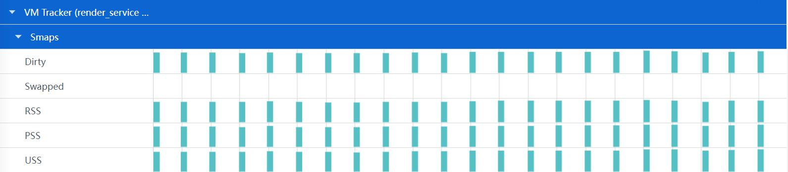
### VM Tracker下的smaps泳道图的点选和框选功能
点选和框选Dirty，Swapped，RSS，PSS，USS的5个泳道图中任一个显示的都是一样的内容，会显示Smaps Statistic和Smaps sample的tab页。
Smaps Statistic的tab页展示。
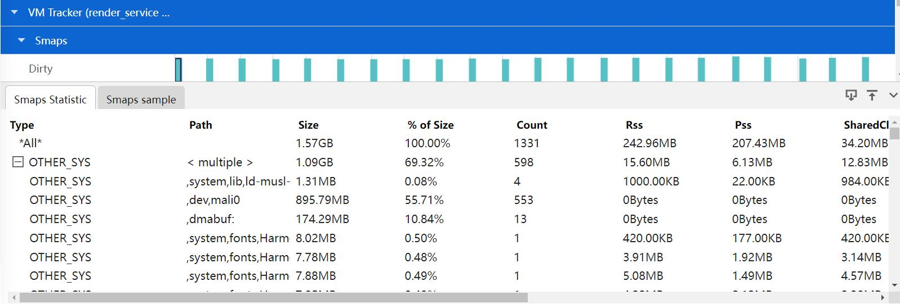
+     Type： 将抓取到的信息根据Type归类。
+     Path：虚拟内存块路径，类型中有多个则显示multiple。
+     Size：在该虚拟内存块路径下内存的size总和。
+     % of Res： 每行的Resident Size 占总Ressident Size的比例。
+     Count：统计的类型个数。
+     Rss： smaps节点中Rss。
+     Pss： smaps节点中Pss。
+     SharedClean： smaps节点中SharedClean。
+     SharedDirty：smaps节点中Shared_Dirty。
+     PrivateClean： smaps节点中PrivateClean。
+     PrivateDirty：smaps节点中PrivateDirty。
+     Swap：smaps节点中Swap。
+     SwapPss：smaps节点中SwapPss。
Smaps sample的tab页展示。

+     TimeStamp： 时间戳信息。
+     Type： 将抓取到的信息根据Type归类。
+     Path：虚拟内存块路径，类型中有多个则显示multiple。
+     Address Range：每段虚拟内存段的开始和结束位置。
+     Rss： smaps节点中Rss。
+     Pss： smaps节点中Pss。
+     SharedClean： smaps节点中SharedClean。
+     SharedDirty：smaps节点中Shared_Dirty。
+     PrivateClean： smaps节点中PrivateClean。
+     PrivateDirty：smaps节点中PrivateDirty。
+     Swap：smaps节点中Swap。
+     SwapPss：smaps节点中SwapPss。
+     Reside： Rss / Size 比值。
+     Protection： 内存块的权限(读写执行执行)。
### VM Tracker下的GPU泳道图展示
smaps泳道图分为GL，Skia Gpu Dump Toal，Skia Gpu Dump Window，Skia Gpu Memory泳道图。

Skia Gpu Memory泳道图点选功能。
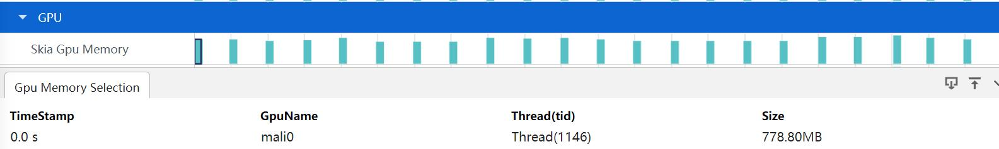
+     TimeStamp：时间戳。
+     GpuName：Gpu名称。
+     Thread(tid)：线程名(线程ID)。
+     Size：对应线程的Gpu的使用size。
Skia Gpu Memory泳道图框选功能。

+     GpuName：Gpu名称。
+     Thread(tid)：线程名(线程ID)。
+     SumSize：Gpu内存总量。
+     AvgSize：Gpu内存的平均值。
+     MaxSize：Gpu内存的最大值。
+     MinSize：Gpu内存的最小值。
Gl泳道图框选功能。

+     TimeStamp：时间戳。
+     GL_PSS：GL_PSS的大小。
Skia Gpu Dump Toal泳道图点选功能。
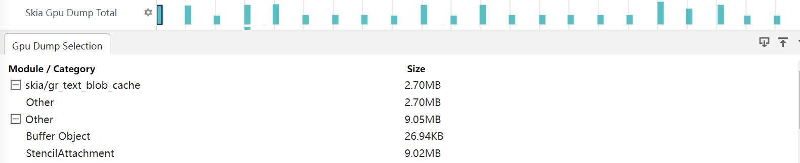
+     Module / Category：模块/目录。
+     Size：按照模块/目录显示size大小。
Skia Gpu Dump Toal泳道图框选功能。

+     TimeStamp：时间戳。
+     Module / Category：模块/目录。
+     AvgSize：对应模块/目录下size的平均值。
+     MaxSize：对应模块/目录下size的最大值。
+     MinSize：对应模块/目录下size的最小值。
Skia Gpu Dump Window泳道图点选功能。

+     Window / Module / Category：窗口/模块/目录。
+     Size：按照窗口/模块/目录显示size大小。
Skia Gpu Dump Window泳道图框选功能。
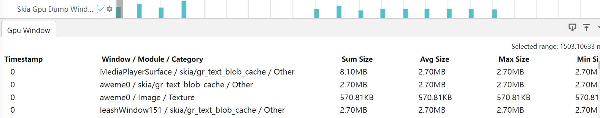
+     TimeStamp：时间戳。
+     Window / Module / Category：窗口/模块/目录。
+     AvgSize：对应窗口/模块/目录下size的平均值。
+     MaxSize：对应窗口/模块/目录下size的最大值。
+     MinSize：对应窗口/模块/目录下size的最小值。