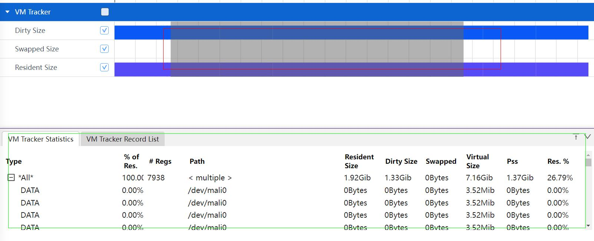

# 进程smaps的抓取和展示说明
smaps展示了一个进程的内存消耗。
## smaps的抓取
### smaps抓取配置参数

配置项说明：
+     Start VM Tracker Record：配置项的总开关。
+     Process：smaps的抓取只能选择单进程抓取。

再点击Record setting，在output file path输入文件名hiprofiler_data_smaps.htrace，拖动滚动条设置buffer size大小是64M，抓取时长是50s。

点击Trace command，就会根据上面的配置生成抓取命令，点击Record抓取，抓取过程中会显示抓取时长。

### smaps展示说明
抓取结束后smaps的trace会自动加载展示。

界面布局介绍：smaps整体界面布局分为3个部分：
+     红色区域：泳道图。
+     绿色区域：详细信息。

### smaps泳道图展示
smaps泳道图展示当前时刻该进程的内存消耗。

### smaps泳道图的框选功能
可以对泳道图进行框选，框选后在最下方的弹出层中会展示框选数据的统计表格，总共有两个个tab页。
VM Tracker Statistics的Tab页如图：

+     Type： 将抓取到的信息根据Type归类，分四类，Data，Text，Const，Other。
+     % of Res： 每行的Resident Size 占总Ressident Size的比例。
+     #Reg：统计的类型个数。
+     Path：虚拟内存块路径，类型中有多个则显示multiple。
+     Resident Size： smaps节点中Rss(Shared_Clean+Shared_Dirty+Private_Clean+Private_Dirty)。
+     Dirty Size：smaps节点中Shared_Dirty + Private_Dirty。
+     Swapped： smaps节点中Swap + SwapPss。
+     Virtual Size：smaps节点中Size。
+     Pss： smaps节点中Pss。
+     Res. %：Resident Size / Virtual Size 比值。
VM Tracker Record List的Tab页如图：

+     Type： 将抓取到的信息根据Type归类，Data，Text，Const，Other。
+     Address Range： 每段虚拟内存段的开始和结束位置。
+     Dirty Size：smaps节点中Shared_Dirty + Private_Dirty。
+     Swapper： smaps节点中Swap + SwapPss。
+     Resident Size：smaps节点中Rss(Shared_Clean+Shared_Dirty+Private_Clean+Private_Dirty)。
+     Virtual Size：smaps节点中Size。
+     Pss：smaps节点中Pss。
+     Reside： Rss / Size 比值。
+     Protection： 内存块的权限(读写执行执行)。
+     Path： 内存段路径。