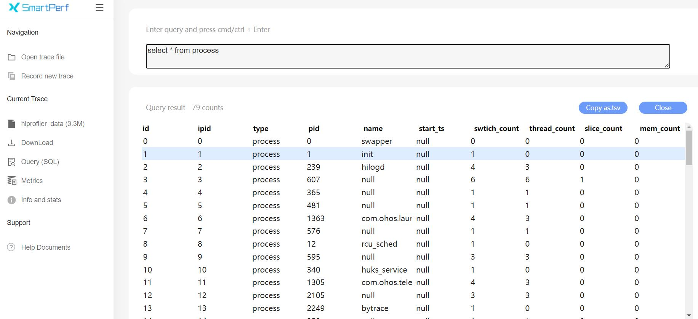
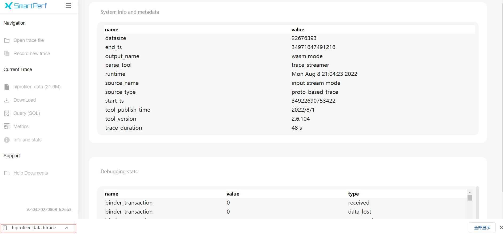

# Sql分析和Metrics说明
Sql功能是方便使用者查询sql语句查看相关业务，Metrics是更高级别的查询接口，无需手动键入任何SQL语句，只需要选择定制好的查询接口，就能获得想要跟踪的结果。
## Sql分析功能介绍
点击Query(SQL)，输入需要查询的sql语句，如select * from process，可以看到进程表数据。

## Metrics功能介绍
Metrics是更高级别的查询接口，无需手动键入任何SQL语句，只需要选择定制好的查询接口，就能获得想要跟踪的结果。
### Metrics查询接口展示
如下图，查询接口在下拉框中，如选择trace_task_names，点击run，就能展示线程和进程相关数据。

## Info和stats功能
点击Info and stats，能查看到meta表和stats表信息。

## Download功能
点击DownLoad按钮，会将在线抓取的文件下载到本地。
